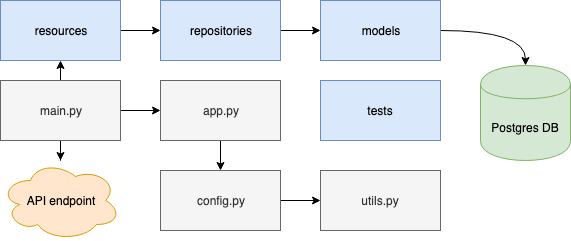

# global-temp-api
Sample flask based application for database querying via RESTful API. Kaggle [climate change](https://www.kaggle.com/berkeleyearth/climate-change-earth-surface-temperature-data) data-set is intended to be used as a data-source for this project.

# Project Structure



Structure above shows high level modules and architecture, and the main app is contained within `src` directory having following contents:
```
src
├── app.py
├── config.py
├── data
│   └── GlobalLandTemperaturesByCity.csv
├── exceptions.py
├── load_mydb.py
├── main.py
├── models
│   ├── __init__.py
│   ├── base.py
│   └── temp_data.py
├── repositories
│   ├── Queries.pgsql
│   ├── Responses.json
│   ├── __init__.py
│   └── temp_data.py
├── resources
│   ├── __init__.py
│   ├── healthcheck.py
│   └── temp_data.py
├── tests
│   ├── __init__.py
│   ├── conftest.py
│   └── test_utils.py
└── utils.py
```

# Setup and Run

## Setup
Use `Makefile` command to create a `venv` and install dependencies.
```
make setup
```
Upon completion you might need to switch to new virtual env using:
```
source .venv/bin/activate
```
### Table Load
Make sure that:
- Database migration has been completed successfully, which can be done via `docker-compose` (see [Run](#Run)).
- The intended `GlobalLandTemperaturesByCity.csv` is located in `src/data` location 

Load csv data using:
```
make load-table
```
A complete load could take upto `80 mins` however, for this use case of `highest average temperature` city, addition of first `200k` rows (should take `< 5 mins`) be sufficient.

## Run
Refer to `sample.env` file and rename that to `.env` for required variables. Makefile contains multiple commands, and in case you tun into any issues, then please run contained commands individually.

### Local PostGRES and API app
For local docker run API should be accesible via [http://127.0.0.1:5000/](http://127.0.0.1:5000/) upon running:
```
make run-docker
```
Upon successful completion, you should be able to reach endpoint [http://127.0.0.1:5000/healthcheck](http://127.0.0.1:5000/healthcheck) and get following response:
```json5
{
    "status": "healthy"
}
```

### Local PostGRES database only
For local db only docker run, database should be accesible via [127.0.0.1:5432](127.0.0.1:5432) upon running:
```
make run-database
```
### Run app only 
Once database is up and running, API app should be accesible via [http://127.0.0.1:8000/](http://127.0.0.1:8000/) using following:
```
make run-gunicorn
```
### Run Migrations
```
chmod+x run-migrations.sh
./run-migrations.sh
```

## Stop
To stop and remove running containers:
```
make stop-docker
```

# API Documentation
The original intent was to integrate API documentation using [apispec](https://apispec.readthedocs.io/en/latest/) or [flask-redoc](https://github.com/mzaglia/flask-redoc) but in order to wrap things up (and for sake of conveniance) it's hosted on [Postman](https://documenter.getpostman.com/view/6285699/TVzXCuxz). 

Sample responses can also be found in `src/repositories/Responses.json`.

## Notes
- Data load for a large csv file (`>500 Mb` in this case) was a bit of a challenge and in a real-world scenario would need optimisations or need to be handled by external orchestrator.
- Integrated documentation was an initial thought, but documentation was done via online Postman documenter. [Collection](./collection_postman.postman_collection.json) is also available locally for use with Postman client.
- This example is meant to be a minimum viable template (mostly to serve use case and showcase structure) and lacks production ready implementations such as: comprehensive unit/integration test coverage, authentication, and robust exception handling.
